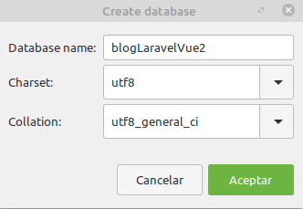

# https://aprendible.com/series/desarrollo-blog

## Ubicación y descarga del proyecto
	https://github.com/Digitalthink-es/BlogLaravelVue2

## 1. Integrando la plantilla HTML
### Repositorio de código
	https://github.com/aprendible/curso-blog/
### Plantilla del curso
	https://aprendible.nyc3.cdn.digitaloceanspaces.com/static/blog.zip
### Creación del proyecto
	composer create-project laravel/laravel blog "5.5.*"
### Sustituir html por texto de plantillas
	Copiar carpetas css e img (contenidas dentro de la carpeta Maquetación) en la ruta public del proyecto de laravel
### Crear archivo layout.blade.php
	Contendrá los elementos reutilizables (cabecera, pie, etc.)
	Se ubica en la carpeta resources/views

## 2. Creando la tabla posts
	Crear base de datos blogLaravelVue2 en mysql
	 
### Crear las tablas ejecutando las migraciones
	php artisan migrate
### Crear modelo para los posts y la migración
	php artisan make:model Post -m  # Con -m se crea la migración
	php artisan migrate
	
## 3. Mostrando los posts desde la base de datos

## 4. Mostrando la fecha de publicación de los posts
	Los campos created_at y updated_at se tratan por defecto como una instancia de tipo Carbon
	Para que una variable de tipo fecha creada manualmente sea tratada de tipo Carbon hay que especificarlo en el modelo
	class Post extends Model
	{
	    protected $dates = ['published_at']; // Trata la fecha creada como instancia de tipo Carbon
	}

## 5. Creando las categorías
	php artisan make:model Category -m  # Con -m se crea la migración
	php artisan migrate

## 6. Qué son y cómo se utilizan los seeders
	Creación de seeder para los posts php artisan make:seeder PostsTableSeeder
	Creación de seeder para las categorías php artisan make:seeder CategoriesTableSeeder
	Referenciar los seeders en el archivo DatabaseSeeder
    public function run()
    {
         $this->call(PostsTableSeeder::class);
         $this->call(CategoriesTableSeeder::class);
    }	

	Ejecutar el seeder
		php artisan db:seed

	Para ejecutar las migraciones y la ejecución de seeds en un único comando
		php artisan migrate:refresh --seed

## 7. Creando las etiquetas
	Es una relación muchos a muchos (1 post puede tener muchas etiquetas y cada etiqueta puede estar referenciado por muchos posts)
	php artisan make:model Tag -m # Con -m se crea la migración
	php artisan migrate
	Para crear la relación entre posts y etiquetas se crea una tabla intermedia que tenga los identifiadores relacionados
		php artisan make:migration create_post_tag_table --create=post_tag # La convención establece el nombre de las tablas en singular y por orden alfabético (ordenación desde la a hasta la z). Con create se indica que se creará la tabla y se utiliza el caracter _ para separar los elementos. Con --create=post_tag indicamos el nombre de la tabla

	En el archivo Post creamos funcion tags para recuperar las etiquetas de un post
    // 1 post puede tener muchas etiquetas
    public function tags()
    {
        return $this->belongsToMany(Tag::class);
    }

	En la vista se recorren todas las etiquetas de un post y se muestra el nombre
	@foreach ($post->tags as $tag)
		{{ $tag->name }}
	@endforeach

## 8. Integrando la plantilla de administración LTE
	https://github.com/ColorlibHQ/AdminLTE/releases/tag/v2.3.11

	Crear carpeta adminlte dentro de public

	Copiar carpeta css, img y js del directorio dist dentro de public

	Copiar las carpetas bootstrap y plugins dentro de public

	Copiar el contenido del archivo starter.html en un nuevo archivo resources/views/admin/layout.blade.php

	Crear archivo resources/views/admin/dashboard.blade.php

	Modificar contenido de web.php, para incluir ruta a la página del dashboard
		Route::get('/admin', function () {
			return view('admin.dashboard');
		});

		Para acceder a esta página http://localhost:8000/admin

## 9. Integrando el login - Parte I

	Para revisar las opciones de cada comando de php artisan podemos ejecutar 

		php artisan -h make:auth

	Ejecutamos php artisan make:auth --views para que cree solo las vistas

		Este comando crea la carpeta resources\views\auth

	En el archivo web.php añadimos

		Route::auth(); que es un método especial para login, registro y recuperación de contraseñas

	Al acceder a la ruta http://localhost:8000/login tenemos acceso al formulario de login de usuario

	Al acceder a la ruta http://localhost:8000/register tenemos acceso al formulario de registro de nuevo usuario

	El el archivo web.php copiar todas las rutas del método auth() de la clase Router.php, reemplazando $this-> por Route::, y comentar las 2 rutas de registro

	    // Authentication Routes...
        $this->get('login', 'Auth\LoginController@showLoginForm')->name('login');
        $this->post('login', 'Auth\LoginController@login');
        $this->post('logout', 'Auth\LoginController@logout')->name('logout');

        // Registration Routes...
        $this->get('register', 'Auth\RegisterController@showRegistrationForm')->name('register');
        $this->post('register', 'Auth\RegisterController@register');

        // Password Reset Routes...
        $this->get('password/reset', 'Auth\ForgotPasswordController@showLinkRequestForm')->name('password.request');
        $this->post('password/email', 'Auth\ForgotPasswordController@sendResetLinkEmail')->name('password.email');
        $this->get('password/reset/{token}', 'Auth\ResetPasswordController@showResetForm')->name('password.reset');
        $this->post('password/reset', 'Auth\ResetPasswordController@reset');

		El resultado final será

		// Authentication Routes...
		Route::get('login', 'Auth\LoginController@showLoginForm')->name('login');
		Route::post('login', 'Auth\LoginController@login');
		Route::post('logout', 'Auth\LoginController@logout')->name('logout');

		// Registration Routes...
		//Route::get('register', 'Auth\RegisterController@showRegistrationForm')->name('register');
		//Route::post('register', 'Auth\RegisterController@register');

		// Password Reset Routes...
		Route::get('password/reset', 'Auth\ForgotPasswordController@showLinkRequestForm')->name('password.request');
		Route::post('password/email', 'Auth\ForgotPasswordController@sendResetLinkEmail')->name('password.email');
		Route::get('password/reset/{token}', 'Auth\ResetPasswordController@showResetForm')->name('password.reset');
		Route::post('password/reset', 'Auth\ResetPasswordController@reset');

	Comentar la línea del archivo register del archivo app.blade.php

		<li><a href="{{ route('register') }}">Register</a></li>

	Como este archivo no va a utilizarse borrar carpeta resources\views\layouts

		En el archivo login.blade.php extender de la plantilla admin.layout @extends('admin.layout')

	Utilizar archivo login.html de la carpeta pages\examples del framework adminlte 2.3.11

## 10. Integrando el login - Parte II

	Cambiar variable locale en app.php para que sea en español

		'locale' => 'en', se sustituye por
		'locale' => 'es',

	Para que los mensajes aparezcan en español hay que tener la carpeta

		resources\lang\es
		
		En la ruta del paquete Laravel Lang https://github.com/Laravel-Lang/lang/tree/master/locales/es y copiar el contenido en la carpeta lang\es creada

	Cambiar variable con el nombre de la aplicación en archivo .env
		
		APP_NAME='Blog de Dani'

	Crear usuario en base de datos para poder iniciar sesión

		php artisan tinker

		$user = new App\User;
		$user->name = "Daniel Martínez Piñero"
		$user->email = "dmpinero@gmail.com"
		$user->password = bcrypt("123456")
		$user->save()

	En el archivo dashboard.blade.php podemos acceder a los datos del usuario autenticado

		
Usuario autenticado: {{ auth()->user()->name }}

	Para que la ruta /home quede protegida y que solo puedan acceder los usuarios autenticados podemos poner un middleware en el archvio web.php. Si el usuario no está autenticado se redirige automáticamente a la página de login

		Route::get('/home', function () {
			return view('admin.dashboard');
		})->middleware('auth');

## 11. Personalizando el menú y utilizando controladores

	Crear archivo resources\views\admin\partials\nav.blade.php

	En la url http://fontawesome.com/icons están disponibles todos los iconos

	Crear archivo resources\views\admin\posts\index.blade.php # En la carpeta posts estarán las vistas relacionadas con los posts

	Crear archivo HomeController
	
		php artisan make:controller HomeController

	Crear archivo PagesController

		php artisan make:controller PagesController

	Crear archivo PostsController

		php artisan make:controller Admin/PostsController

	Modificar archivo web.php para apuntar al método index

		Route::get('admin/posts','Admin\PostsController@index');

	La ruta de administración de los posts es http://localhost:8000/admin/posts

## 12. Mostrando los posts con DatatablesJs

	Copiar ruta de los css del archivo pages\tables\data.html en la página layout.blade.php
		
		link rel="stylesheet" href="/adminlte/plugins/datatables/dataTables.bootstrap.css">

	Copiar ruta de los archivos javascript del archivo pages\tables\data.html en la página layout.blade.php

		
		

	Copiar el siguiente script del archivo pages\tables\data.html en la página layout.blade.php

		

## 13. Reestructuración de código y activación de links

	Todos los middleware tienen un método handle que se ejecuta automáticamente

	Los middleware se registran en el archivo kernel.php

	Cambiar nombre HomeController por AdminController

## 14. Creación del formulario para ingresar posts

	Creación de función create en PostsController.php

	public function create()
    {
        return view('admin.posts.create');
    }

## 15. Implementación de un selector de fechas "datepicker"

	Con la directiva @stack podemos hacer inclusión de contenido (como yield, pero sin sobreescribir el contenido)
	@stack('styles')
	@stack('scripts')

	Para utilizarlo, en lugar de @section utilizamos @push
	@push('styles')
	@endpush

	@push('scripts')
	@endpush

## 16. Integrando un editor de contenido y un selector múltiple

	Incluir CKEditor en el archivo create.blade.php

	<!-- CK Editor -->
    

	CKEDITOR.replace('editor');

	<textarea name="body" id="editor" -- El id del textarea debe ser el mismo de la línea CKEDITOR.replace('editor');

	Incluir select múltiple para las etiquetas

	<!-- Select2 -->
    

	$(".select2").select2();

	<!-- Select2 -->
  	<link rel="stylesheet" href="/adminlte/plugins/select2/select2.min.css">

v

	Post.php

		protected $guarded = [];

	Layout.blade.php

		@if (session()->has('flash'))
			

			{{ session('flash') }}
			

		@endif	

	PostsController.php

		public function store(Request $request)
		{
			// Validación
			//dd($request->all());

			// Almacenamiento
			$post = new Post();
			$post->title = $request->title;
			$post->body = $request->body;
			$post->excerpt = $request->excerpt;
			$post->published_at = Carbon::parse($request->published_at);
			$post->category_id =  $request->category;

			$post->save();

			// Etiquetas
			$post->tags()->attach($request->tags);
			
			return back()->with('flash', 'Tu publicación ha sido creada');
		}

## 18. Validando el formulario

	<input name="title" 
		type="text" 
		class="form-control"
		value=" {{ old('title') }}"
		placeholder="Ingresa aquí el título de la publicación">

## 19. Query scopes

	Con las query scopes podemos reutilizar consultas comunes en la aplicación

	Para crear un query scope se pone con scopeNombreFuncion, por ejemplo en Post.php

    public function scopePublished($query)
    {
        $query->whereNotNull('published_at') // No mostrar publicaciones sin fecha de publicación
                    ->where('published_at', '<=', Carbon::now()) // No mostrar publicaciones con fecha de publicación posterior al día de hoy
                    ->latest('published_at');
    }

	En el modelo Post obtenemos los resultados, llamando al query scope sin la palabra "scope"
	$posts = Post::published()->get();

## 20. Mostrando los posts individuales

	Crear controlador PostsController (ya hay uno definido en el namespace Admin, este es otro)

		php artisan make:controller PostsController

	Crear vista resources\views\posts\show.blade.php

	Crear vista resources\views\partials\disqus-script.blade.php

## 21. Mostrando URLs amigables

	Copiar carpeta flat_web_icon_set desde github de Aprendible (https://github.com/aprendible/curso-blog/public/img) en carpeta public/img

	En el archivo PostController.blade.php obtener el post sin tener que pasar el id

		public function show(Post $post)
		{
			return view('posts.show', compact('post'));
		}
	
	En el archivo web.php

		Route::get('blog/{post}', 'PostsController@show');

	El el archivo Post.php para poder referenciar a los posts por nombre y no por id redefinimos el métiodo getRouteKeyName()

	Para poder acceder a una url amigable utilizamos en show.blade.php la función 

		str_slug($post->title) # Esta función sustituye las mayúsculas por minúsculas y los espacios en blanco por un guión

	Crear en la migración de la tabla post un campo para almacenar la url

		$table->string('url');

	En el seeder PostTableSeeder incluir el campo url

		$post->url = str_slug($post->title);

	Ejecutar migración

		php artisan migrate:refresh --seed

	En el archivo welcome.blade.php cambiar

		$post->id por $post->url

	Por último hay que indicar que la búsqueda sea por el campo url

	    public function getRouteKeyName()
		{
			return 'url';
		}

	Crear archivo UsersTableSeeder.php para incluir un nuevo usuario cuando se borre la base de datos
	Crear archivo TagsTableSeeder.php para incluir 2 nuevas etiquetas cuando se borre la base de datos

	Modificar archivo PostsController de amin para incluir la url

		$post->url = str_slug($request->title);

## 22. Título y descripción para SEO

	Cada página tendrá su propio título. En la página layout.blade.php poner

		El título por defecto será el que esté configurado en la propiedad app.name del archivo .env, en caso de que no esté definida la propiedad meta-title, que es la que prevalece.
	
		<title>@yield('meta-title', config('app.name') . " | Blog")</title>
		<meta name="description" content="@yield('meta-description', 'Este es el blog de Zendero')">

## 23. Social Links

	Modificación de estilos de iconos de redes sociales en style.css
	Modificación de textos de iconos de redes sociales en show.blade.php

	En la URL github.com/bradvin/social-share-urls tenemos proyecto github para integrar las redes sociales en los distintos lenguajes de programación

	Creación de archivo partials.social-links.blade.php